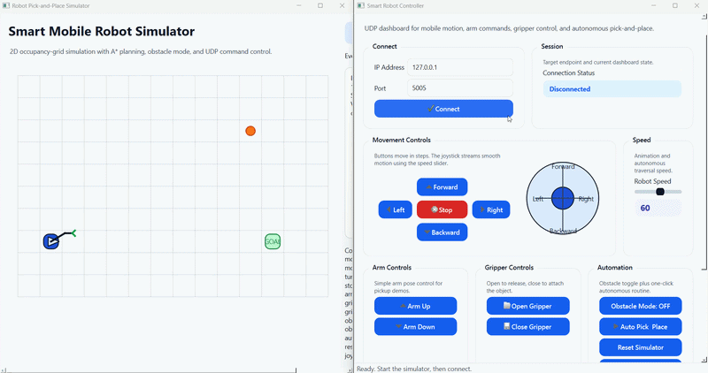
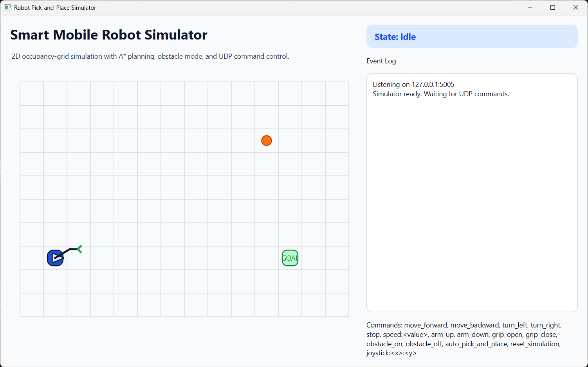
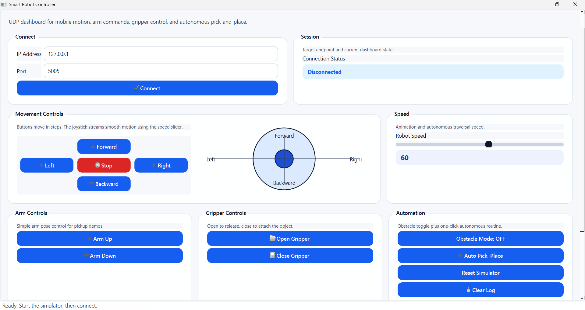

# Smart Mobile Robot Controller and Pick-and-Place Simulator

> A modular robotics simulation system demonstrating GUI-based control, UDP communication, and autonomous path planning using A*.

## Demo



<p align="center">
  
  
</p>

---

## Project Overview

This project is a Python-based robotics software system that combines a desktop control interface with a 2D robot simulator.

It demonstrates key software engineering concepts applied to robotics:

* GUI development using PySide6
* UDP-based inter-process communication
* Modular architecture and clean code organization
* State-driven robot behavior
* Grid-based path planning using A*

The system is designed as a portfolio project to be clear, interactive, and easily extendable.

---

## System Architecture

The project consists of two independent desktop applications:

* **Controller Application**
  Acts as an operator dashboard for sending commands and monitoring system behavior.

* **Simulator Application**
  Visualizes a mobile robot, environment, objects, and executes commands or autonomous behaviors.

Communication between both components is handled via UDP sockets.

---

## Features

* Dual-application architecture (Controller + Simulator)

* Real-time UDP communication

* Interactive PySide6 GUI with:

  * Connect / Disconnect workflow
  * Movement controls and joystick input
  * Speed adjustment slider
  * Arm and gripper controls
  * Obstacle toggle
  * Simulation reset
  * Event logging

* 2D Simulator environment with:

  * Occupancy grid representation
  * Robot visualization
  * Object and goal zone
  * Optional obstacles
  * Path visualization (planned + executed)

* Autonomous Pick-and-Place sequence:

  1. Navigate to object
  2. Pick object
  3. Plan path using A*
  4. Avoid obstacles
  5. Deliver to goal

* A* path planning implemented in a dedicated module

* Randomized obstacle generation for dynamic testing

* Basic unit testing for planner validation

---

## Technologies

* Python
* PySide6
* UDP sockets (Python standard library)
* A* path planning (grid-based)
* `unittest`

---

## Project Structure

```text
robot_project/
  requirements.txt
  .gitignore
  algorithms/
    astar.py
  controller/
    main_controller.py
    controller_ui.py
    udp_client.py
  simulator/
    main_simulator.py
    simulator_ui.py
    environment.py
    robot.py
    udp_server.py
  tests/
    test_astar.py
```

---

## How It Works

### Controller

* Connects to the simulator via UDP
* Sends real-time commands
* Enables/disables controls based on connection state

Supported commands include:

```
move_forward, move_backward, turn_left, turn_right, stop
speed:<value>
arm_up, arm_down
grip_open, grip_close
obstacle_on, obstacle_off
auto_pick_and_place
reset_simulation
joystick:<x>:<y>
```

---

### Simulator

* Listens for UDP commands
* Updates robot state
* Renders environment continuously

Supports:

* Manual control
* Continuous joystick movement
* Object manipulation
* Autonomous execution

---

### Path Planning

A* is used on a 2D grid:

* Obstacles = blocked cells
* Planner computes optimal path
* Used for both:

  * Robot → Object
  * Object → Goal

Implemented in:

```
algorithms/astar.py
```

---

## Installation

### 1. Clone Repository

```bash
git clone <your-repository-url>
cd robot_project
```

### 2. Create Virtual Environment

**Windows**

```bash
python -m venv .venv
.venv\Scripts\activate
```

**macOS / Linux**

```bash
python3 -m venv .venv
source .venv/bin/activate
```

### 3. Install Dependencies

```bash
pip install -r requirements.txt
```

---

## How to Run

Start the simulator first:

```bash
python simulator/main_simulator.py
```

Then start the controller:

```bash
python controller/main_controller.py
```

### Default Settings

* Host: `127.0.0.1`
* Port: `5005`

### Typical Workflow

1. Launch simulator
2. Launch controller
3. Click **Connect**
4. Control manually or use joystick
5. Enable obstacles if needed
6. Run **Auto Pick & Place**

---

## Testing

Run unit tests:

```bash
python -m unittest tests.test_astar
```

---

## Author Contribution

This project demonstrates my ability to:

* Design modular software architecture
* Develop GUI applications using PySide6
* Implement inter-process communication via UDP
* Build and integrate path planning algorithms
* Model robot behavior and simulation environments
* Prepare software systems for demonstration and presentation

---

## Future Work

* Additional planning algorithms
* More advanced robot kinematics
* Sensor simulation
* Data logging and telemetry
* Improved environment generation
* Packaging and deployment

---

## Notes

This project focuses on software engineering and system design rather than physical realism.

The goal is to provide a clear, interactive, and extensible robotics simulation platform.
